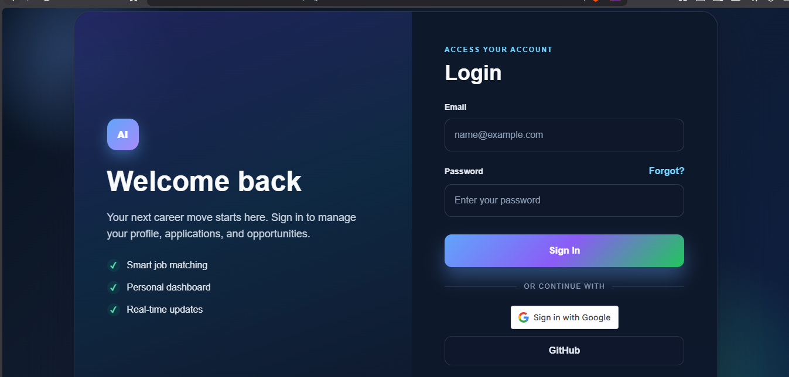
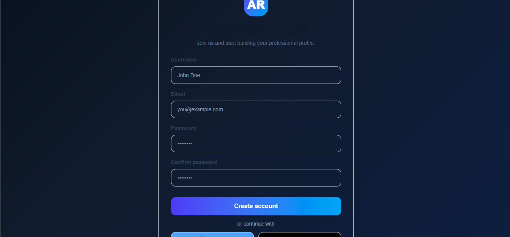
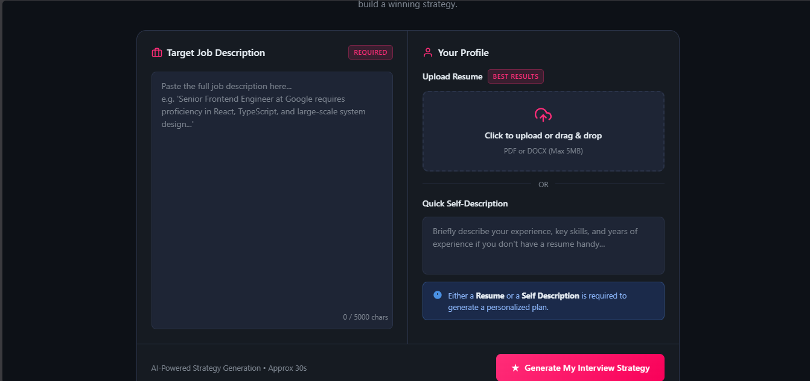
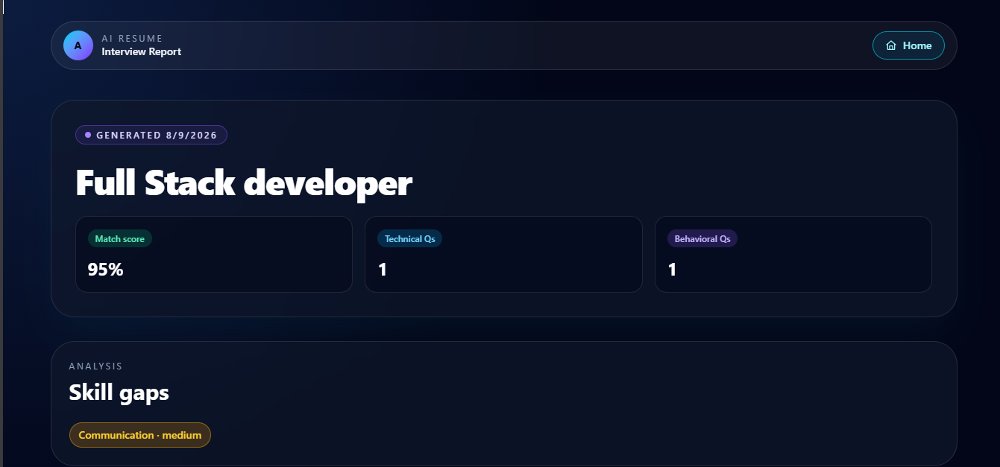

# AI Resume Interview App

A full-stack application for resume-based interview preparation and AI-assisted evaluation. The project includes a Node.js/Express backend for authentication, interview logic, MongoDB storage, and Gemini-powered interview report generation, plus a React + Vite frontend for the user experience.

## Features

- User registration and login
- Protected interview routes
- Resume and job description input flow
- AI-generated interview analysis using Google Gemini
- MongoDB-backed data persistence
- React frontend with route-based navigation

## Tech Stack

### Backend
- Node.js
- Express
- MongoDB + Mongoose
- JWT authentication
- Cookie-based auth
- Google GenAI integration
- Multer and PDF parsing support

### Frontend
- React 19
- Vite
- React Router
- Axios
- SCSS styling

## Project Structure

```text
airesume-interview/
├── Backend/
│   ├── src/
│   ├── data/
│   ├── .env
│   ├── package.json
│   └── server.js
├── Fronted/
│   ├── src/
│   ├── public/
│   ├── package.json
│   ├── vite.config.js
│   └── index.html
├── README.md
└── .gitignore
```

## Screenshots

### Login Page


### Register Page


### Resume Upload / Interview Setup


### AI Interview Report


## Prerequisites

Before running the app with Docker, make sure you have:

- Docker installed and running
- Docker Compose installed
- A Google API key for Gemini access

## Docker Setup

This project is designed to run with Docker for the easiest local setup.

### 1) Create environment file

Create a `.env` file in the `Backend` folder with values like:

```env
MONGO_URI=mongodb://mongo:27017/airesume
GOOGLE_API_KEY
=your_google_api_key_here
PORT=3000
```

### 2) Start the app with Docker Compose

From the project root, run:

```bash
docker compose up --build
```

This will start the backend and MongoDB containers, and the frontend can be configured to connect to the backend through the browser.

### 3) Access the app

- Frontend: http://localhost:5173
- Backend API: http://localhost:3000
- MongoDB: mongodb://localhost:27017

## Docker Commands

```bash
# Build images
docker compose build

# Start services
docker compose up

# Stop services
docker compose down

# Rebuild and restart
docker compose up --build --force-recreate
```

## Local Setup (Alternative)

If you do not want to use Docker, you can run the services manually.

### Backend

```bash
cd Backend
npm install
```

Create a `.env` file inside `Backend`:

```env
MONGO_URI=mongodb://127.0.0.1:27017/airesume
GOOGLE_API_KEY=your_google_api_key_here
PORT=3000
```

Then start:

```bash
npm run dev
```

### Frontend

```bash
cd Fronted
npm install
npm run dev
```

The frontend runs on:

```text
http://localhost:5173
```

## Running the App

1. Start MongoDB or use Docker containers.
2. Start the backend.
3. Start the frontend.
4. Open the frontend URL in the browser.

## Important Notes

- The backend is configured for CORS on `http://localhost:5173`.
- If `GOOGLE_API_KEY` is not set, the app will fall back to a mock interview report.
- Authentication uses cookies and JWTs, so the frontend must send credentials for protected routes.
- Docker is the recommended way to run the project locally for consistent setup.

## Common Commands

### Backend
```bash
cd Backend
npm install
npm run dev
npm start
```

### Frontend
```bash
cd Fronted
npm install
npm run dev
npm run build
```

## License

This project currently uses the ISC license as defined in the backend package configuration.