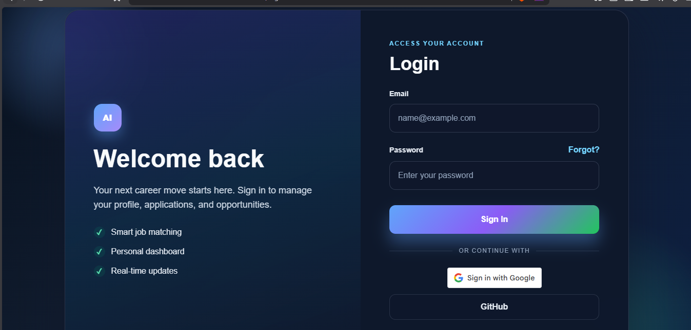
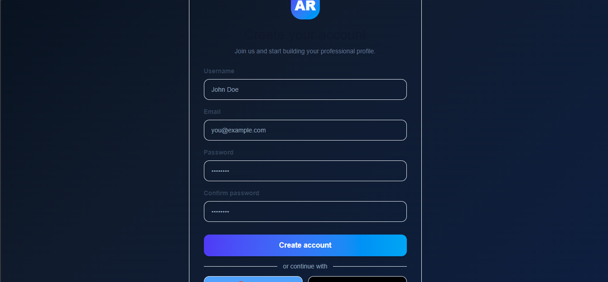
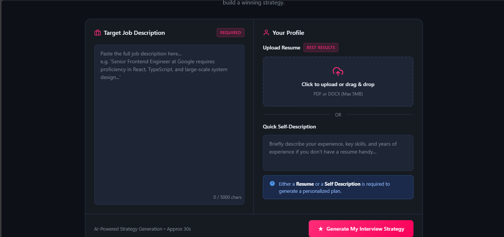
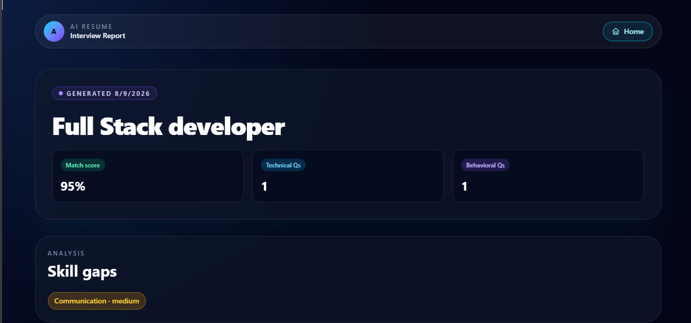
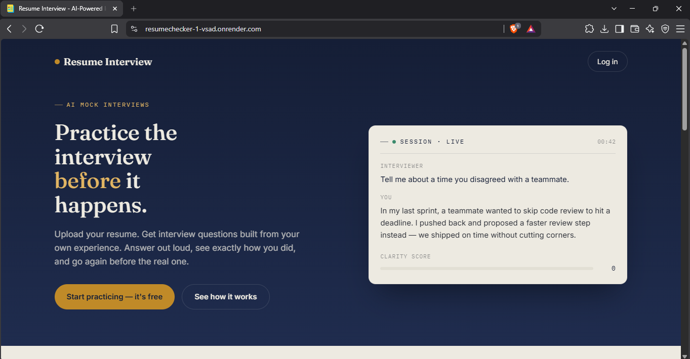

# AI Resume Interview App

A full-stack resume and interview preparation platform that lets users upload a resume or provide a short profile summary, paste a target job description, and generate an AI-assisted interview report. The app is built with a Node.js/Express backend, MongoDB data layer, and a React + Vite frontend.

## Features

- User registration and login
- JWT + cookie-based authentication
- Protected interview and resume routes
- Resume upload or quick profile summary entry
- Job description-driven mock interview analysis
- AI-generated interview guidance using Google Gemini
- Resume PDF generation support
- MongoDB-backed persistence for users and reports
- React-based dashboard and routing experience

## Tech Stack

### Backend
- Node.js
- Express
- MongoDB + Mongoose
- JWT authentication
- Cookie-based session handling
- Google GenAI integration
- Multer for file upload
- PDF parsing and generation utilities

### Frontend
- React 19
- Vite
- React Router
- Axios
- SCSS styling

## Project Structure

```text
airesume-interview/
├── Backend/
│   ├── src/
│   ├── data/
│   ├── Dockerfile
│   ├── package.json
│   └── server.js
├── Fronted/
│   ├── src/
│   ├── public/
│   ├── Dockerfile
│   ├── package.json
│   ├── vite.config.js
│   └── index.html
├── docker-compose.yml
├── README.md
├── screenshots/
└── .gitignore
```

## Live Demo

- Frontend: https://resumechecker-1-vsad.onrender.com/
- Backend API: served from the same deployment environment

## Prerequisites

Before starting the app locally, make sure you have:

- Node.js 18+ or later
- npm
- Docker and Docker Compose (recommended)
- A Google API key for Gemini access

## Environment Setup

The backend expects an environment file at `Backend/src/.env`.

Create it with the following values:

```env
MONGO_URI=mongodb://127.0.0.1:27017/airesume
GOOGLE_API_KEY=your_google_api_key_here
PORT=3000
JWT_SECRET=your_jwt_secret
JWT_EXPIRES_IN=1d
```

For Docker Compose, the project already sets `MONGO_URI`, `PORT`, `NODE_ENV`, `JWT_SECRET`, and `JWT_EXPIRES_IN` in `docker-compose.yml`, but the backend still reads the env file from `Backend/src/.env` when present.

## Running with Docker Compose

From the project root:

```bash
docker compose up --build
```

This starts:

- Frontend: http://localhost:5173
- Backend API: http://localhost:3000
- MongoDB: mongodb://localhost:27017

Useful commands:

```bash
# Build the images
docker compose build

# Start services
docker compose up

# Stop services
docker compose down

# Rebuild and restart
docker compose up --build --force-recreate
```

## Running Locally Without Docker

### Backend

```bash
cd Backend
npm install
npm run dev
```

### Frontend

```bash
cd Fronted
npm install
npm run dev
```

Then open:

```text
http://localhost:5173
```

## Application Flow

1. Register or log in.
2. Paste a target job description.
3. Upload a resume or enter a brief self-description.
4. Generate the interview report.
5. Review the AI interview insights and generated output.

## Screenshots

### Login


### Register


### Interview Setup


### Interview Report


### Home Dashboard


## Notes

- The backend uses CORS for the hosted frontend origin and will also work with local development on port 5173.
- If `GOOGLE_API_KEY` is missing, the app can still run in a fallback mode depending on the service logic.
- Authentication uses cookies and JWTs; protected routes require credentials.
- Docker is the recommended method for a consistent local environment.

## Common Commands

### Backend

```bash
cd Backend
npm install
npm run dev
npm start
```

### Frontend

```bash
cd Fronted
npm install
npm run dev
npm run build
```

## License

This project is licensed under the ISC license, as defined in the backend package configuration.